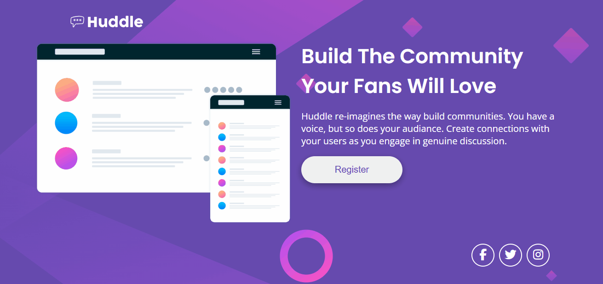

# Projeto Portfólio Amanda Di Lorenzo
Este é o meu primeiro projeto pessoal desenvolvido do zero por mim, me desafiando a desenvolver um portfólio profissional, utilizando HTML e CSS.

## Índice

- [Visão geral](#visãogeral)
  - [O desafio](#o-desafio)
  - [Link](#link)
- [Meu processo](#meu-processo)
  - [Tecnologias utilizadas](#built-with)
  - [Aprendizados](#aprendizados)
   - [Recursos úteis](#recursos-úteis)
- [Autora](#autora)

## Visão geral

### O desafio
Consiste em realizar um layout (tanto para desktop quanto para mobile), de uma Landing Page da Huddle, que siga corretamente o design proposto e os estados de focos para elementos interativos.

### Link
- URL do site ativo: 

## Meu processo

### Tecnologias utilizadas
- HTML
- CSS

### Aprendizados
 - Maior habilidade no uso de variáveis para um código mais limpo.
 - Melhoria na prática de uso do flexbox.
 - Prática na utilização do Grid.

 ### Recursos úteis
 - Google fonts: para estilizar as fontes, conforme o desafio pediu.
 - Responsive view: maior visualização do layout em mobile, para ajustar corretamente, caso fosse necessário, a fim de trazer responsividade ao meu projeto em telas menores.
 - Perfect pixel: para auxiliar nos valores das propriedades de height, width, padding e margin, e chegar o mais próximo possível, do layout do desafio.
 - Font awesome: para utilizar os ícones pedidos pelo desafio.

 ## Autora

 https://github.com/mandiilorenzo